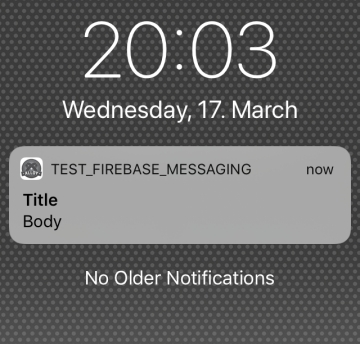
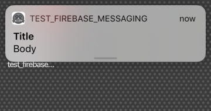

# Firebase Cloud Messaging - Titanium Module

Use the native Firebase SDK (iOS/Android) in Axway Titanium. This repository is part of the [Titanium Firebase](https://github.com/hansemannn/titanium-firebase) project.

## Supporting this effort

The whole Firebase support in Titanium is developed and maintained by the community (`@hansemannn` and `@m1ga`). To keep
this project maintained and be able to use the latest Firebase SDK's, please see the "Sponsor" button of this repository,
thank you!

## Topics
* [Requirements](#requirements)
* [Download](#download)
* [iOS notes](#ios-notes)
* [Android Notes](#android-notes)
* [API: Methods, Properties, Events](#api)
* [Example](#example)
* [Sending push messages](#sending-push-messages)
* [Build from source](#build)

## Requirements
- [x] iOS: [Firebase-Core](https://github.com/hansemannn/titanium-firebase-core)
- [x] iOS: Titanium SDK 7.3.0+
- [x] Android: Titanium SDK 7.0.0+, [Ti.PlayServices](https://github.com/appcelerator-modules/ti.playservices) module
- [x] Read the [Titanium-Firebase](https://github.com/hansemannn/titanium-firebase#installation) install part if you set up a new project.


## Download
- [x] [Stable release](https://github.com/hansemannn/titanium-firebase-cloud-messaging/releases)
- [x] [](http://gitt.io/component/firebase.cloudmessaging)

## iOS notes:

<table>
<tr>
<td style="vertical-align:top;">

</td>
<td style="vertical-align:top;">

</td>
</tr>
</table>

To register for push notifications on iOS, you only need to call the Titanium related methods as the following:
```js
// Listen to the notification settings event
Ti.App.iOS.addEventListener('usernotificationsettings', function eventUserNotificationSettings() {
  // Remove the event again to prevent duplicate calls through the Firebase API
  Ti.App.iOS.removeEventListener('usernotificationsettings', eventUserNotificationSettings);

  // Register for push notifications
  Ti.Network.registerForPushNotifications({
    success: function () { ... },
    error: function () { ... },
    callback: function () { ... } // Fired for all kind of notifications (foreground, background & closed)
  });
});

// Register for the notification settings event
Ti.App.iOS.registerUserNotificationSettings({
  types: [
    Ti.App.iOS.USER_NOTIFICATION_TYPE_ALERT,
    Ti.App.iOS.USER_NOTIFICATION_TYPE_SOUND,
    Ti.App.iOS.USER_NOTIFICATION_TYPE_BADGE
  ]
});
```

## Android Notes:

<table>
<tr>
<td style="vertical-align:top;">

</td>
<td style="vertical-align:top;">

</td>
</tr>
<tr><td>
Big image notification with colored icon/appname
</td>
<td>
Big text notification with colored icon/appname
</td>
</tr>
</table>


### Updates to the Manifest

If you run into errors in combination with firebase.analytics e.g. `Error: Attempt to invoke virtual method 'getInstanceId()' on a null object reference` you can add:

```xml
<service android:name="com.google.firebase.components.ComponentDiscoveryService" >
	<meta-data android:name="com.google.firebase.components:com.google.firebase.iid.Registrar"
		android:value="com.google.firebase.components.ComponentRegistrar" />
</service>
```
to the tiapp.xml


### Setting the Notification Icon

For a `data notification` you have to place a notification icon "notificationicon.png" into the following folder:
 `[application_name]/[app*]/platform/android/res/drawable/`
 or
 `[application_name]/[app*]/platform/android/res/drawable-*` (if you use custom dpi folders)

<small>**\*** = Alloy</small>

To use the custom icon for a `notification message` you need to add this attribute within the `<application/>` section of your `tiapp.xml`:

```xml
<meta-data android:name="com.google.firebase.messaging.default_notification_icon" android:resource="@drawable/notificationicon"/>
```

Otherwise the default icon will be used.

It should be flat (no gradients), white and face-on perspective and have a transparent background. The icon will only show the outline/shape of your icon so make sure all you e.g. white is transparent otherwise it will just be a square.

> **Note**: You should generate the icon for all resolutions.

```
22 × 22 area in 24 × 24 (mdpi)
33 × 33 area in 36 × 36 (hdpi)
44 × 44 area in 48 × 48 (xhdpi)
66 × 66 area in 72 × 72 (xxhdpi)
88 × 88 area in 96 × 96 (xxxhdpi)
```

You can use this script to generate it **once you put** the icon in `drawable-xxxhdpi/notificationicon.png` and have
Image Magick installed. On macOS, you can install it using `brew install imagemagick`, on Windows you can download it [here](https://imagemagick.org/script/download.php).

```sh
#!/bin/sh

ICON_SOURCE="app/platform/android/res/drawable-xxxhdpi/notificationicon.png"
if [ -f "$ICON_SOURCE" ]; then
    mkdir -p "app/platform/android/res/drawable-xxhdpi"
    mkdir -p "app/platform/android/res/drawable-xhdpi"
    mkdir -p "app/platform/android/res/drawable-hdpi"
    mkdir -p "app/platform/android/res/drawable-mdpi"
    convert "$ICON_SOURCE" -resize 72x72 "app/platform/android/res/drawable-xxhdpi/notificationicon.png"
    convert "$ICON_SOURCE" -resize 48x48 "app/platform/android/res/drawable-xhdpi/notificationicon.png"
    convert "$ICON_SOURCE" -resize 36x36 "app/platform/android/res/drawable-hdpi/notificationicon.png"
    convert "$ICON_SOURCE" -resize 24x24 "app/platform/android/res/drawable-mdpi/notificationicon.png"
else
    echo "No 'notificationicon.png' file found in app/platform/android/res/drawable-xxxhdpi"
fi
```

### Data / Notification messages

On Android there are two different messages that the phone can process: `Notification messages` and `Data messages`. A `Notification message` is processed by the system, the `Data message` is handeled by `showNotification()` in `TiFirebaseMessagingService`. Using the `notification` block inside the POSTFIELDS will send a `Notification message`.

Supported data fields:
* "title" => "string"
* "message" => "string"
* "big_text" => "string"
* "big_text_summary" => "string"
* "icon" => "Remote URL"
* "image" => "Remote URL"
* "rounded_large_icon" => "Boolean" (to display the largeIcon as a rounded image when the icon field is present)
* "force_show_in_foreground" => "Boolean" (show notification even app is in foreground)
* "id" => "int"
* "color" => will tint the app name and the small icon next to it
* "vibrate" => "boolean"
* "sound" => "string" (e.g. "notification.mp3" will play /platform/android/res/raw/notification.mp3)
* "badge" => "int" (if supported by the phone it will show a badge with this number)

Supported notification fields:
* "title" => "string"
* "body" => "string"
* "color" => "#00ff00",
* "tag" => "custom_notification_tag",   // push with the same tag will replace each other
* "sound" => "string" (e.g. "notification.mp3" will play /platform/android/res/raw/notification.mp3)

### Android: Note about custom sounds
To use a custom sound > Android O you need to create a second channel. The default channel will always use the default notification sound on the device!

### Android: Note for switching between v<=v2.0.2 and >=v2.0.3 if you use notification channels with custom sounds
With versions prior to 2.0.3 of this module, FirebaseCloudMessaging.createNotificationChannel would create the notification sound uri using the resource id of the sound file in the `res/raw` directory. However, as described in this [android issue](https://issuetracker.google.com/issues/131303134), those resource ids can change to reference different files (or no file) between app versions, and  that happens the notification channel may play a different or no sound than originally intended.
With version 2.0.3 and later, we now create the uri's using the string filename so that it will not change if resource ids change. So if you are on version <=2.0.2 and are switching to version >=2.0.3, you will want to check if this is a problem for you by installing a test app using version >= 2.0.3 as an upgrade to a previous test app using version <= 2.0.2. Note that you should not uninstall the first app before installing the second app; nor should you reset user data.
If it is a problem you can workaround by first deleting the existing channel using deleteNotificationChannel, and then recreating the channel with the same settings as before, except with a different id. Don't forget that your push server will need to be version aware and send to this new channel for newer versions of your apps.

## API

### `FirebaseCloudMessaging`

#### Methods

`registerForPushNotifications()`

`appDidReceiveMessage(parameters)` (iOS only)
  - `parameters` (Object)

Note: Only call this method if method swizzling is disabled (enabled by default). Messages are received via the native delegates instead,
so receive the `gcm.message_id` key from the notification payload instead.

`sendMessage(parameters)`
  - `parameters` (Object)
    - `messageID` (String)
    - `to` (String)
    - `timeToLive` (Number)
    - `data` (Object)

`subscribeToTopic(topic)`
  - `topic` (String)

`unsubscribeFromTopic(topic)`
  - `topic` (String)

`setNotificationChannel(channel)` - Android-only
  - `channel` (NotificationChannel Object) Use `Ti.Android.NotificationManager.createNotificationChannel()` to create the channel and pass it to the function. See [Titanium.Android.NotificationChannel](https://docs.appcelerator.com/platform/latest/#!/api/Titanium.Android.NotificationChannel)

  _Prefered way_ to set a channel. As an alternative you can use `createNotificationChannel()`

`createNotificationChannel(parameters)` - Android-only

- `parameters` (Object)
  - `sound` (String) optional, refers to a sound file (without extension) at `platform/android/res/raw`. If sound == "default" or not passed in, will use the default sound. If sound == "silent" the channel will have no sound
  - `channelId` (String) optional, defaults to "default"
  - `channelName` (String) optional, defaults to `channelId`
  - `importance` (String) optional, either "low", "high", "default". Defaults to "default", unless sound == "silent", then defaults to "low".
  - `lights` (Boolean) optional, defaults to `false`
  - `showBadge` (Boolean) optional, defaults to `false`

  Read more in the [official Android docs](https://developer.android.com/reference/android/app/NotificationChannel).

`deleteNotificationChannel(channelId)` - Android-only
  - `channelId` (String) - same as the id used to create in createNotificationChannel

`setForceShowInForeground(showInForeground)` - Android-only
  - `showInForeground` (Boolean) Force the notifications to be shown in foreground.

`clearLastData()` - Android-only
  - Will empty the stored lastData values.

`getToken()` - Android-only
  - Returns the current FCM token.

`deleteToken()` - Android-only
  - Removes the current FCM token.


#### Properties

`shouldEstablishDirectChannel` (Number, get/set)

`fcmToken` (String, get)

`apnsToken` (String, set) (iOS only)

`lastData` (Object) (Android only)
The propery `lastData` will contain the data part when you send a notification push message (so both nodes are visible inside the push payload). Read before calling `registerForPushNotifications()`.

#### Events

`didReceiveMessage`
  - `message` (Object)

	iOS Note: This method is only called on iOS 10+ and only for direct messages sent by Firebase. Normal Firebase push notifications
	are still delivered via the Titanium notification events, e.g.
	```js
	Ti.App.iOS.addEventListener('notification', function(event) {
	  // Handle foreground notification
	});

	Ti.App.iOS.addEventListener('remotenotificationaction', function(event) {
	  // Handle background notification action click
	});
	```

`didRefreshRegistrationToken`
  - `fcmToken` (String)

`error` (Android only)
  - `error` (String): Error during token registration

`subscribe` (Android only)
  - `success` (Boolean): Successfully subscribed

`unsubscribe` (Android only)
  - `success` (Boolean): Successfully unsubscribed

`tokenRemoved` (Android only)
  - `success` (Boolean): Successfully removed token

## Example

Full example for Android/iOS:

```js

if (OS_IOS) {
  const FirebaseCore = require('firebase.core');
  fc.configure();
}

// Important: The cloud messaging module has to imported after (!) the configure()
// method of the core module is called
const FirebaseCloudMessaging = require('firebase.cloudmessaging');

// Called when the Firebase token is registered or refreshed.
FirebaseCloudMessaging.addEventListener('didRefreshRegistrationToken', function(e) {
    Ti.API.info('Token', e.fcmToken);
});

// Called when direct messages arrive. Note that these are different from push notifications.
FirebaseCloudMessaging.addEventListener('didReceiveMessage', function(e) {
    Ti.API.info('Message', e.message);
});

// Android-only: For configuring custom sounds and importance for the generated system
// notifications when app is in the background
if (OS_ANDROID) {
    // FirebaseCloudMessaging.createNotificationChannel({
    //     sound: 'warn_sound',
    //     channelId: 'default',
    //     channelName: 'General Notifications',
    //     importance: 'high'
    // });

    const channel = Ti.Android.NotificationManager.createNotificationChannel({
        id: 'default',
        name: 'Default channel',
        importance: Ti.Android.IMPORTANCE_DEFAULT,
        enableLights: true,
        enableVibration: true,
        showBadge: true
    });
    // if you use a custom id you have to set the same to the `channelId` in you php send script!

    FirebaseCloudMessaging.notificationChannel = channel;

    // display last data:
    Ti.API.info(`Last data: ${FirebaseCloudMessaging.lastData}`);
} else {
	// iOS
	// Listen to the notification settings event
	Ti.App.iOS.addEventListener('usernotificationsettings', function eventUserNotificationSettings() {
	  // Remove the event again to prevent duplicate calls through the Firebase API
	  Ti.App.iOS.removeEventListener('usernotificationsettings', eventUserNotificationSettings);

	  // Register for push notifications
	  Ti.Network.registerForPushNotifications({
	    success: function () {
            if (!!fcm) {
                console.log('New token', fcm.fcmToken);
            }
        },
	    error: function (e) {
            console.error(e);
        },
	    callback: function (e) {
            // Fired for all kind of notifications (foreground, background & closed)
            console.log(e.data);
        }
	  });
	});

	// Register for the notification settings event
	Ti.App.iOS.registerUserNotificationSettings({
	  types: [
	    Ti.App.iOS.USER_NOTIFICATION_TYPE_ALERT,
	    Ti.App.iOS.USER_NOTIFICATION_TYPE_SOUND,
	    Ti.App.iOS.USER_NOTIFICATION_TYPE_BADGE
	  ]
	});
}

// Register the device with the FCM service.
if (OS_ANDROID) {
    FirebaseCloudMessaging.registerForPushNotifications();
}

// Check if token is already available.
if (FirebaseCloudMessaging.fcmToken) {
    Ti.API.info('FCM-Token', FirebaseCloudMessaging.fcmToken);
} else {
    Ti.API.info('Token is empty. Waiting for the token callback ...');
}

// Subscribe to a topic.
FirebaseCloudMessaging.subscribeToTopic('testTopic');
```

Example to get the the resume data/notification click data on Android:

```javascript
const handleNotificationData = (notifObj) => {
	if (notifObj) {
		notifData = JSON.parse(notifObj);
		// ...process notification data...
		FirebaseCloudMessaging.clearLastData();
	}
}

// Check if app was launched on notification click
const launchIntent = Ti.Android.rootActivity.intent;
handleNotificationData(launchIntent.getStringExtra("fcm_data"));

Ti.App.addEventListener('resumed', function() {
	// App was resumed from background on notification click
	const currIntent = Titanium.Android.currentActivity.intent;
	const notifData = currIntent.getStringExtra("fcm_data");
	handleNotificationData(notifData);
});
```

## Sending push messages

### using curl

Data message:
```
curl -i -H 'Content-type: application/json' -H 'Authorization: key=#####KEY#####' -XPOST https://fcm.googleapis.com/fcm/send -d '{
  "registration_ids":["####DEVICE_ID#####"],
  "data": {"title":"Push Title", "message":"Push content", "name1":"value1", "badge":"150"}
}'
```

Notification message:
```
curl -i -H 'Content-type: application/json' -H 'Authorization: key=#####KEY#####' -XPOST https://fcm.googleapis.com/fcm/send -d '{
  "registration_ids":["####DEVICE_ID#####"],
  "notification": {"title":"Push Title", "body":"Push content"}
}'
```

###  using PHP
To test your app you can use this PHP script to send messages to the device/topic:

```php
<?php
    $url = 'https://fcm.googleapis.com/fcm/send';

    $fields = [
        'to' => '/topics/testTopic', // or device token
        'notification' => [
            'title' => 'TiFirebaseMessaging',
            'body' => 'Message received',
            "badge"=> 1,
        ],
        'data' => [
            'key1' => 'value1',
            'key2' => 'value2'
        ]
    ];

    $headers = [
        'Authorization: key=SERVER_ID_FROM_FIREBASE_SETTIGNS_CLOUD_MESSAGING', 'Content-Type: application/json'
    ];
    $ch = curl_init();

    curl_setopt($ch, CURLOPT_URL, $url);
    curl_setopt($ch, CURLOPT_POST, true);
    curl_setopt($ch, CURLOPT_HTTPHEADER, $headers);
    curl_setopt($ch, CURLOPT_RETURNTRANSFER, true);
    curl_setopt($ch, CURLOPT_POSTFIELDS, json_encode($fields));

    $result = curl_exec($ch);

    echo $result;
    curl_close($ch);
?>
```

Run it locally with `php filelane.php` or put it on a webserver where you can execute PHP files.

### extended PHP Android example
```php
<?php $url = 'https://fcm.googleapis.com/fcm/send';

    $fields = array (
        'to' => "TOKEN_ID",
        // 'to' => "/topics/test",
        /* 'notification' => array (
         		"title" => "TiFirebaseMessaging",
         		"body" => "Message received 📱😂",
         		"timestamp"=>date('Y-m-d G:i:s'),
        ),*/
        'data' => array(
            "test1" => "value1",
            "test2" => "value2",
            "timestamp"=>date('Y-m-d G:i:s'),
            "title" => "title",
            "message" => "message",
            "big_text"=>"big text even more text big text even more text big text even more text big text even more text big text even more text big text even more text big text even more text big text even more text big text even more text big text even more text big text even more text big text even more text big text even more text big text even more text ",
            "big_text_summary"=>"big_text_summary",
            "icon" => "http://via.placeholder.com/150x150",
            "image" => "http://via.placeholder.com/350x150",	// won't show the big_text
            "force_show_in_foreground"=> true,
            "color" => "#ff6600",
            "channelId" => "default"	// or a different channel
        )
    );

    $headers = array (
        'Authorization: key=API_KEY',
        'Content-Type: application/json'
    );

    $ch = curl_init ();
    curl_setopt ( $ch, CURLOPT_URL, $url );
    curl_setopt ( $ch, CURLOPT_POST, true );
    curl_setopt ( $ch, CURLOPT_HTTPHEADER, $headers );
    curl_setopt ( $ch, CURLOPT_RETURNTRANSFER, true );
    curl_setopt ( $ch, CURLOPT_POSTFIELDS, json_encode($fields));

    $result = curl_exec ( $ch );
    echo $result."\n";
    curl_close ( $ch );
?>

```

## Parse

You can use Parse with this module: https://github.com/timanrebel/Parse/pull/59 in combination with Firebase. You include and configure both modules and send your deviceToken to the Parse backend.

If you send a push over e.g. <a href="https://sashido.io">Sashido</a> you can either send a normal text or a json with:
```json
{"alert":"test from sashido", "text":"test"}
```
With the JSON you can set a title/alert and the text of the notification.

## Build

### iOS

```bash
cd ios
ti build -p ios --build-only
```

### Android

```bash
cd android
ti build -p android --build-only
```

## Legal

(c) 2017-Present by Hans Knöchel & Michael Gangolf
