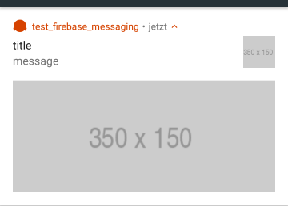

# Firebase Cloud Messaging - Titanium Module

Use the native Firebase SDK (iOS/Android) in Axway Titanium. This repository is part of the [Titanium Firebase](https://github.com/hansemannn/titanium-firebase) project.

## Requirements
- [x] The [Firebase Core](https://github.com/hansemannn/titanium-firebase-core) module.
The options `googleAppID` and `GCMSenderID` are required for Android, or `file` (e.g. `GoogleService-Info.plist`) for iOS.
- [x] iOS: Titanium SDK 6.3.0+
- [x] Android: Titanium SDK 7.0.0+, [Ti.PlayServices](https://github.com/appcelerator-modules/ti.playservices) module

## Download
- [x] [Stable release](https://github.com/hansemannn/titanium-firebase-cloud-messaging/releases)
- [x] [](http://gitt.io/component/firebase.cloudmessaging)

## iOS notes:

To register for push notifications on iOS, startin in 2.0.0, you only need to call the Titanium related methods as the following:
```js
// Listen to the notification settings event
Ti.App.iOS.addEventListener('usernotificationsettings', function eventUserNotificationSettings() {
  // Remove the event again to prevent duplicate calls through the Firebase API
  Ti.App.iOS.removeEventListener('usernotificationsettings', eventUserNotificationSettings);

  // Register for push notifications
  Ti.Network.registerForPushNotifications({
    success: function () { ... },
    error: function () { ... },
    callback: function () { ... } // Fired for all kind of notifications (foreground, background & closed)
  });
});

// Register for the notification settings event
Ti.App.iOS.registerUserNotificationSettings({
  types: [
    Ti.App.iOS.USER_NOTIFICATION_TYPE_ALERT,
    Ti.App.iOS.USER_NOTIFICATION_TYPE_SOUND,
    Ti.App.iOS.USER_NOTIFICATION_TYPE_BADGE
  ]
});
```

## Android notes:

<br/>
_Big image notification with colored icon/appname_

<br/>
_Big text notification with colored icon/appname_

### Updates to the Manifest

Merge the following keys to the `<android>` section of the tiapp.xml in order to use GCM.

```xml
<android xmlns:android="http://schemas.android.com/apk/res/android">
	<manifest>
		<application>
			<service android:name="MY_PACKAGE_NAME.gcm.RegistrationIntentService" android:exported="false" />

			<receiver android:name="com.google.android.gms.measurement.AppMeasurementReceiver" android:enabled="true">
			   <intent-filter>
				  <action android:name="com.google.android.gms.measurement.UPLOAD" />
			   </intent-filter>
			</receiver>  

			<service android:name="MY_PACKAGE_NAME.gcm.GcmIntentService" android:exported="false">
			   <intent-filter>
				  <action android:name="com.google.android.c2dm.intent.RECEIVE" />
			   </intent-filter>
			</service>

			<service android:name="MY_PACKAGE_NAME.gcm.GcmIntentService" android:exported="false">
			   <intent-filter>
				  <action android:name="com.google.android.c2dm.intent.SEND" />
			   </intent-filter>
			</service>

			<service android:name="MY_PACKAGE_NAME.gcm.GcmIDListenerService" android:exported="false">
			   <intent-filter>
				  <action android:name="com.google.android.gms.iid.InstanceID" />
			   </intent-filter>
			</service>
		</application>
	</manifest>
</android>   
```

### Setting the Notification Icon

You have to place a notification icon "notificationicon.png" into the following folder:
 '[application_name]/app/platform/android/res/drawable/'

Otherwise the default icon will be used.

#### Alternative

Taken over from [ti.goosh](https://github.com/caffeinalab/ti.goosh):
If you add this attribute within the `<application/>` section of your `tiapp.xml`:

```xml
<meta-data android:name="com.google.firebase.messaging.default_notification_icon"
           android:resource="@drawable/notification_icon"/>
```

Then FCM will set the notification tray icon taking it from `[app*]/platform/android/res/drawable-*/notification_icon.png`.

**\*** = Alloy

It should be flat (no gradients), white and face-on perspective.

> **Note**: You should generate the icon for all resolutions.

```
22 × 22 area in 24 × 24 (mdpi)
33 × 33 area in 36 × 36 (hdpi)
44 × 44 area in 48 × 48 (xhdpi)
66 × 66 area in 72 × 72 (xxhdpi)
88 × 88 area in 96 × 96 (xxxhdpi)
```

You can use this script to generate it **once you put** the icon in `drawable-xxxhdpi/notification_icon.png`.

```sh
#!/bin/sh

ICON_SOURCE="app/platform/android/res/drawable-xxxhdpi/notification_icon.png"
if [ -f "$ICON_SOURCE" ]; then
	mkdir -p "app/platform/android/res/drawable-xxhdpi"
	mkdir -p "app/platform/android/res/drawable-xhdpi"
	mkdir -p "app/platform/android/res/drawable-hdpi"
	mkdir -p "app/platform/android/res/drawable-mdpi"
	convert "$ICON_SOURCE" -resize 72x72 "app/platform/android/res/drawable-xxhdpi/notification_icon.png"
	convert "$ICON_SOURCE" -resize 48x48 "app/platform/android/res/drawable-xhdpi/notification_icon.png"
	convert "$ICON_SOURCE" -resize 36x36 "app/platform/android/res/drawable-hdpi/notification_icon.png"
	convert "$ICON_SOURCE" -resize 24x24 "app/platform/android/res/drawable-mdpi/notification_icon.png"
else
	echo "No 'notification_icon.png' file found in app/platform/android/res/drawable-xxxhdpi"
fi
```

### Data / Notification messages

On Android there are two different messages that the phone can process: `Notification messages` and `Data messages`. A `Notification message` is processed by the system, the `Data message` is handeled by `showNotification()` in `TiFirebaseMessagingService`. Using the `notification` block inside the POSTFIELDS will send a `Notification message`.

Supported data fields:
* "title" => "string"
* "message" => "string"
* "big_text" => "string"
* "big_text_summary" => "string"
* "icon" => "Remote URL"
* "image" => "Remote URL"
* "force_show_in_foreground" => "Boolean" (show notification even app is in foreground)
* "id" => "int"
* "color" => will tint the app name and the small icon next to it

Supported notification fields:
* "title" => "string"
* "body" => "string"

## API's

### `FirebaseCloudMessaging`

#### Methods

##### `registerForPushNotifications()`

##### `appDidReceiveMessage(parameters)` - iOS only
  - `parameters` (Object)

Note: Only call this method if method swizzling is disabled (enabled by default). Messages are received via the native delegates instead,
so receive the `gcm.message_id` key from the notification payload instead.

##### `sendMessage(parameters)`
  - `parameters` (Object)
    - `messageID` (String)
    - `to` (String)
    - `timeToLive` (Number)
    - `data` (Object)

##### `subscribeToTopic(topic)`
  - `topic` (String)

##### `unsubscribeFromTopic(topic)`
  - `topic` (String)

##### `createNotificationChannel(parameters)` - Android-only

  - `parameters` (Object)
    - `sound` (String) optional, refers to a sound file (without extension) at `platform/android/res/raw`. If sound == "default" or not passed in, will use the default sound. If sound == "silent" the channel will have no sound
    - `channelId` (String) optional, defaults to "default"
    - `channelName` (String) optional, defaults to `channelId`
    - `importance` (String) optional, either "low", "high", "default". Defaults to "default", unless sound == "silent", then defaults to "low".

Read more in the [official Android docs](https://developer.android.com/reference/android/app/NotificationChannel).

#### Properties

##### `shouldEstablishDirectChannel` (Number, get/set)

##### `fcmToken` (String, get)

##### `apnsToken` (String, set) - iOS only

##### `lastData` (Object) - Android only
The propery `lastData` will contain the data part when you send a notification push message (so both nodes are visible inside the push payload).

#### Events

##### `didReceiveMessage`
  - `message` (Object)

iOS Note: This method is only called on iOS 10+ and only for direct messages sent by Firebase. Normal Firebase push notifications
are still delivered via the Titanium notification events, e.g.
```js
Ti.App.iOS.addEventListener('notification', function(event) {
  // Handle foreground notification
});

Ti.App.iOS.addEventListener('remotenotificationaction', function(event) {
  // Handle background notification action click
});
```

##### `didRefreshRegistrationToken`
  - `fcmToken` (String)

## Example
```js
var core = require('firebase.core');
var fcm = require('firebase.cloudmessaging');

// Configure core module (required for all Firebase modules).
core.configure({
    GCMSenderID: '...',
    googleAppID: '...', // Differs between Android and iOS.
    // file: 'GoogleService-Info.plist' // If using a plist (iOS only).
});

// Called when the Firebase token is registered or refreshed.
fcm.addEventListener('didRefreshRegistrationToken', function(e) {
    Ti.API.info('Token', e.fcmToken);
});

// Called when direct messages arrive. Note that these are different from push notifications.
fcm.addEventListener('didReceiveMessage', function(e) {
    Ti.API.info('Message', e.message);
});

// Android-only: For configuring custom sounds and importance for the generated system
// notifications when app is in the background
OS_ANDROID && fcm.createNotificationChannel({
    sound: 'warn_sound',
    channelId: 'general',
    channelName: 'General Notifications',
    importance: 'high' //will pop in from the top and make a sound
})

// Register the device with the FCM service.
fcm.registerForPushNotifications();

// Check if token is already available.
if (fcm.fcmToken) {
    Ti.API.info('FCM-Token', fcm.fcmToken);
} else {
    Ti.API.info('Token is empty. Waiting for the token callback ...');
}

// Subscribe to a topic.
fcm.subscribeToTopic('testTopic');
```

## Send FCM messages with PHP
To test your app you can use this PHP script to send messages to the device/topic:

```php
<?php
    $url = 'https://fcm.googleapis.com/fcm/send';

    $fields = [
        'to' => '/topics/testTopic', // or device token
        'notification' => [
            'title' => 'TiFirebaseMessaging',
            'body' => 'Message received'
        ],
        'data' => [
            'key1' => 'value1',
            'key2' => 'value2'
        ]
    ];

    $headers = [
        'Authorization: key=SERVER_ID_FROM_FIREBASE_SETTIGNS_CLOUD_MESSAGING', 'Content-Type: application/json'
    ];
    $ch = curl_init();

    curl_setopt($ch, CURLOPT_URL, $url);
    curl_setopt($ch, CURLOPT_POST, true);
    curl_setopt($ch, CURLOPT_HTTPHEADER, $headers);
    curl_setopt($ch, CURLOPT_RETURNTRANSFER, true);
    curl_setopt($ch, CURLOPT_POSTFIELDS, json_encode($fields));

    $result = curl_exec($ch);

    echo $result;
    curl_close($ch);
?>
```

Run it locally with `php filelane.php` or put it on a webserver where you can execute PHP files.

### Android example
```php
<?php $url = 'https://fcm.googleapis.com/fcm/send';

	$fields = array (
			'to' => "TOKEN_ID",
			// 'to' => "/topics/test",
			/* 'notification' => array (
			 		"title" => "TiFirebaseMessaging",
			 		"body" => "Message received 📱😂",
			 		"timestamp"=>date('Y-m-d G:i:s'),
			),*/
			'data' => array(
				"test1" => "value1",
				"test2" => "value2",
				"timestamp"=>date('Y-m-d G:i:s'),
				"title" => "title",
				"message" => "message",
				"big_text"=>"big text even more text big text even more text big text even more text big text even more text big text even more text big text even more text big text even more text big text even more text big text even more text big text even more text big text even more text big text even more text big text even more text big text even more text ",
				"big_text_summary"=>"big_text_summary",
				"icon" => "http://via.placeholder.com/150x150",
				"image" => "http://via.placeholder.com/350x150",	// won't show the big_text
				"force_show_in_foreground"=> true,
				"color" => "#ff6600",
				"channelId" => "default"	// or a different channel
			)
	);

	$headers = array (
			'Authorization: key=API_KEY',
			'Content-Type: application/json'
	);

	$ch = curl_init ();
	curl_setopt ( $ch, CURLOPT_URL, $url );
	curl_setopt ( $ch, CURLOPT_POST, true );
	curl_setopt ( $ch, CURLOPT_HTTPHEADER, $headers );
	curl_setopt ( $ch, CURLOPT_RETURNTRANSFER, true );
	curl_setopt ( $ch, CURLOPT_POSTFIELDS, json_encode($fields));

	$result = curl_exec ( $ch );
	echo $result."\n";
	curl_close ( $ch );
?>

```


## Build

### iOS

```js
cd ios
appc run -p ios --build-only
```

### Android

> **Note**: When building for Android, make sure you have the [firebase.core](https://github.com/hansemannn/titanium-firebase-core) module installed globally (`~/Library/Application Support/Titanium/modules/android/firebase.core`). Otherwise, the firebase-iid library will not be referenced properly.

```js
cd android
appc run -p android --build-only
```

## Legal

(c) 2017-Present by Hans Knöchel & Michael Gangolf
